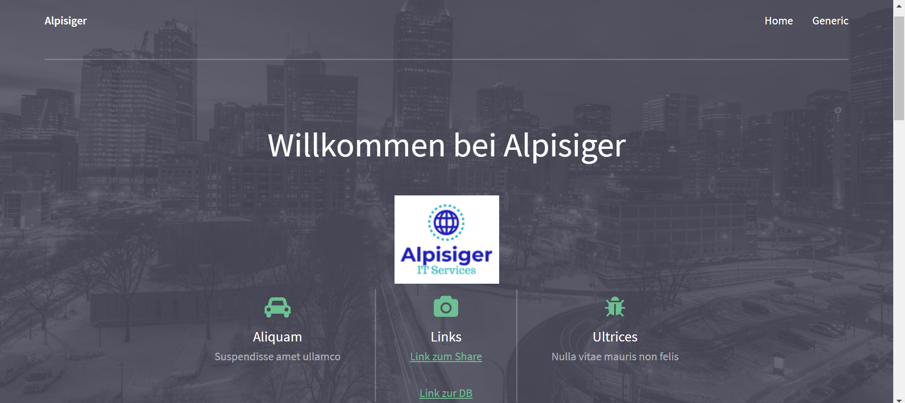
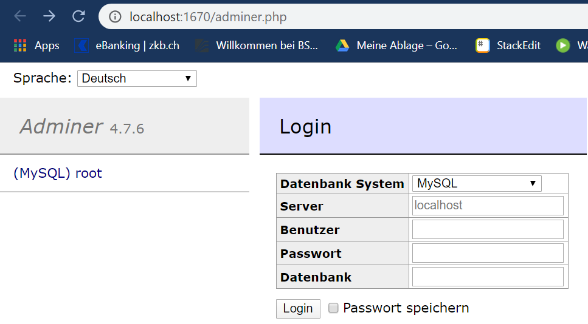

# Dokumentation LB2
## Modul239
**Modul 239:** Internetserver in Betrieb nehmen integrieren
**Autor:** Sarah Gisiger, Matay Alp
**Datum:** 30.04.20

## Allgemeines
Unser Vagrantfile haben wir so geschrieben, sodass es drei VM's erstellt. Für alle VM's haben wir jeweils 'ubuntu/xenial64' als Box verwendet. Nachfolgend werden die drei VM's beschrieben:

### LB2_web
#### Fakten
>- **Name:** LB2_web
>- **Installierte Dienste:** Apache
>- **Portweitetleitung:** Port 1657
>- **Synchronisierter Folder:** "." 
>- **[Link zur Index-Seite](http://localhost:1657/)**

#### Weiteres
> Die Index Seite haben wir selber erstellt. Wir suchten ein Template aus dem Internet raus und änderten es etwas ab. Da die Webseite selbst nicht weiter relevant für die LB ist, haben wir sie einfach gehalten und auch nicht vervollständigt. 
> 
> Desweiteren ist der Link zum Share und zur Datenbank ebenfalls auf der Index Seite verlinkt.

#### Vorgehen
> Um unsere Index Seite verwenden zu können, haben wir im Vagrantfile den Pfad unter synced_folder folgendermassen abgeändert: **web.vm.synced_folder ".", "/var/www/html"**

#### Bild


#### Code
##### HTML
```css
<!DOCTYPE HTML>
<html>
	<head>
		<title>Alpisiger</title>
		<meta charset="utf-8" />
		<meta name="viewport" content="width=device-width, initial-scale=1" />
		<link rel="stylesheet" href="assets/css/main.css" />
	</head>
	<body>

		<!-- Header -->
			<header id="header">
				<div class="inner">
					<a href="index.html" class="logo"><strong>Alpisiger</strong></a>
					<nav id="nav">
						<a href="index.html">Home</a>
						<a href="generic.html">Generic</a>
					</nav>
					<a href="#navPanel" class="navPanelToggle"><span class="fa fa-bars"></span></a>
				</div>
			</header>

		<!-- Banner -->
			<section id="banner">
				<div class="inner">
					<header>
						<h1>Willkommen bei Alpisiger</h1>
					</header>

					

					<div class="flex ">

						<div>
							<span class="icon fa-car"></span>
							<h3>Aliquam</h3>
							<p>Suspendisse amet ullamco</p>
						</div>

						<div>
							<span class="icon fa-camera"></span>
							<h3>Links</h3>
							<a href="http://localhost:1680/">Link zum Share</a>
							<br><br>
							<a href="http://localhost:1670/adminer.php">Link zur DB</a>
						</div>

						<div>
							<span class="icon fa-bug"></span>
							<h3>Ultrices</h3>
							<p>Nulla vitae mauris non felis</p>
						</div>
					</div>

					<footer>
						<a href="#" class="button">Get Started</a>
					</footer>
				</div>
			</section>


		<!-- Three -->
			<section id="three" class="wrapper align-center">
				<div class="inner">
					<div class="flex flex-2">
						<article>
							<div class="image round">
								
							</div>
							<header>
								<h3>Lorem ipsum<br /> dolor amet nullam</h3>
							</header>
							<p>Morbi in sem quis dui placerat ornare. Pellentesquenisi<br />euismod in, pharetra a, ultricies in diam sed arcu. Cras<br />consequat  egestas augue vulputate.</p>
							<footer>
								<a href="#" class="button">Learn More</a>
							</footer>
						</article>
						<article>
							<div class="image round">
								
							</div>
							<header>
								<h3>Sed feugiat<br /> tempus adipicsing</h3>
							</header>
							<p>Pellentesque fermentum dolor. Aliquam quam lectus<br />facilisis auctor, ultrices ut, elementum vulputate, nunc<br /> blandit ellenste egestagus commodo.</p>
							<footer>
								<a href="#" class="button">Learn More</a>
							</footer>
						</article>
					</div>
				</div>
			</section>

		<!-- Footer -->
			<footer id="footer">
				<div class="inner">

					<h3>Get in touch</h3>

					<form action="#" method="post">

						<div class="field half first">
							<label for="name">Name</label>
							<input name="name" id="name" type="text" placeholder="Name">
						</div>
						<div class="field half">
							<label for="email">Email</label>
							<input name="email" id="email" type="email" placeholder="Email">
						</div>
						<div class="field">
							<label for="message">Message</label>
							<textarea name="message" id="message" rows="6" placeholder="Message"></textarea>
						</div>
						<ul class="actions">
							<li><input value="Send Message" class="button alt" type="submit"></li>
						</ul>
					</form>

				</div>
			</footer>

		<!-- Scripts -->
			<script src="assets/js/jquery.min.js"></script>
			<script src="assets/js/skel.min.js"></script>
			<script src="assets/js/util.js"></script>
			<script src="assets/js/main.js"></script>

	</body>
</html>
```
##### Vagrant - nur für LB2_web
```css
config.vm.define "web" do |web|
  web.vm.box = "ubuntu/xenial64"

  #hier werden div. VM Konfigurationen eingestellt
  web.vm.provider "virtualbox" do |v|
    v.memory = "512"
    v.name = "LB2_web"
    v.cpus = 1
  end

  #Hier wird die Port-Weiterleitung eingerichtet
  web.vm.network "forwarded_port", guest:80, host:1657, auto_correct:true

  #hier wird angegeben, dass der Folder "." auf der lokalen Maschine = /var/www/html auf der VM ist
  web.vm.synced_folder ".", "/var/www/html"

  #Hier wird angegeben, dass in der Shell Apache2 installiert werden soll
  config.vm.provision "shell", inline: <<-SHELL
    sudo apt-get update
    sudo apt-get -y install apache2
  SHELL
end
```


### LB2_share
#### Fakten
>- **Name:** LB2_web
>- **Installierte Dienste:** Apache
>- **Portweitetleitung:** Port 1680
>- **Synchronisierter Folder:** "./share" 
>- **[Link zum Share](http://localhost:1680/)**

#### Weiteres
> Damit der Share funktioniert, wird der Folder './share' benötigt.
> 
> In diesem Share werden alle Dateien vom Ordner angezeigt. Wenn eine Datei geändert wird, wird dies ebenfalls auf der Seite gezeigt. 


#### Vorgehen
> Damit der Share funktioniert muss zuerst ein Ordner erstellt werden, welcher anschliessend geshared wird. Dafür haben wir ein Ordner namens 'share' erstellt. Anschliessend muss der Pfad im Vagrantfile unter synced_folder folgendermassen abgeändert werden: **web.vm.synced_folder "./share", "/var/www/html"**
> 
> Wichtig hier ist, dass im Vagrantfile in der Shell angegeben wird, dass die Index Seite, welche Apache standardmässig erstellt, gelöscht wird. Falls dies nicht gemacht wird, sieht man nicht den Share, sondern die Standard-Index Seite von Apache.

#### Bild


#### Code
##### Vagrant - nur für LB2_share
```css
config.vm.define "share" do |sh|
  sh.vm.box = "ubuntu/xenial64"

  #hier werden div. VM Konfigurationen eingestellt
  sh.vm.provider "virtualbox" do |v|
    v.memory = "1024"
    v.name = "LB2_share"
    v.cpus = 1
  end

  #Hier wird die Port-Weiterleitung eingerichtet
  sh.vm.network "forwarded_port", guest:80, host:1680, auto_correct:true

  #hier wird angegeben, dass der Folder "./share/" auf der lokalen Maschine = /var/www/html auf der VM ist
  sh.vm.synced_folder "./share/", "/var/www/html"

  #Hier wird angegeben, dass in der Shell Apache2 installiert werden soll. Ausserdem wird die index.html Seite, welche Standardmässig von Apache erstellt wird, gelöscht
  sh.vm.provision "shell", inline: <<-SHELL
    sudo apt-get update
    sudo apt-get -y install apache2
  
    #Falls die Datei 'index.html' existiert, soll sie gelöscht werden
    if [ -e /var/www/html/index.html ]; then
      rm /var/www/html/index.html
    fi
  SHELL
end
```

### LB2_db
#### Fakten
>- **Name:** LB2_db
>- **Installierte Dienste:** Apache, PHP, debconf-utils
>- **Portweitetleitung:** Port 1670
>- ~~**Synchronisierter Folder:**~~ 
>- **Anmeldedaten:** Benutzer = root, Passwort = Pas$worD
>- **[Link zur DB](http://localhost:1670/adminer.php)**

#### Weiteres
> Als Vorlage für diese VM haben wir das Vagrantfile von [hier](https://github.com/mc-b/M300/tree/master/vagrant/db) verwendet. 


#### Vorgehen
> Wir haben die Vorlage verwendet. Zuerst haben wir uns das File angeschaut und Zeilen, die wir nicht verstanden, nachgeschaut. Anschliessend haben wir selber ein paar Kleinigkeiten abgeändert und noch etwas dazu Kommentiert.

#### Bild


#### Code
##### Vagrant - nur für LB2_share
```css
config.vm.define "db" do |db|
  db.vm.box = "ubuntu/xenial64"

  #hier werden div. VM Konfigurationen eingestellt
  db.vm.provider "virtualbox" do |v|
    v.memory = "512"
    v.name = "LB2_db"
    v.cpus = 1
  end

  #Hier wird die Port-Weiterleitung eingerichtet
  db.vm.network "forwarded_port", guest:80, host:1670, auto_correct:true

  config.vm.provision "shell", inline: <<-SHELL
    set -o xtrace
    #debconf-utils = Debian configuration management system
    #installation von debconf-utils, mysql Passwort setzung & installation von apache und php  
    sudo apt-get update
    sudo apt-get -y install debconf-utils
    sudo apt-get -y install apache2
    sudo debconf-set-selections <<< 'mysql-server mysql-server/root_password password Pas$worD'
    sudo debconf-set-selections <<< 'mysql-server mysql-server/root_password_again password Pas$worD'
    sudo apt-get -y install php libapache2-mod-php php-curl php-cli php-mysql php-gd mysql-client mysql-server
     
    #Herunterladen von 'latest.php' in das erstellte Verzeichnis & schliesslich Restart von Apache 
    sudo mkdir /usr/share/adminer
    sudo wget "http://www.adminer.org/latest.php" -O /usr/share/adminer/latest.php
    sudo ln -s /usr/share/adminer/latest.php /usr/share/adminer/adminer.php
    echo "Alias /adminer.php /usr/share/adminer/adminer.php" | sudo tee /etc/apache2/conf-available/adminer.conf
    sudo a2enconf adminer.conf
    sudo service apache2 restart
  SHELL
end
```

## Vagrantfile Code
``` css
Vagrant.configure(2) do |config|
######################################################################################################
#---------------------------------------------- VM Web ----------------------------------------------#
######################################################################################################
  config.vm.define "web" do |web|
    web.vm.box = "ubuntu/xenial64"

    #hier werden div. VM Konfigurationen eingestellt
    web.vm.provider "virtualbox" do |v|
      v.memory = "512"
      v.name = "LB2_web"
      v.cpus = 1
    end

    #Hier wird die Port-Weiterleitung eingerichtet
    web.vm.network "forwarded_port", guest:80, host:1657, auto_correct:true

    #hier wird angegeben, dass der Folder "." auf der lokalen Maschine = /var/www/html auf der VM ist
    web.vm.synced_folder ".", "/var/www/html"

    #Hier wird angegeben, dass in der Shell Apache2 installiert werden soll
    config.vm.provision "shell", inline: <<-SHELL
      sudo apt-get update
      sudo apt-get -y install apache2
    SHELL
  end

######################################################################################################
#--------------------------------------------- VM Share ---------------------------------------------#
######################################################################################################
  config.vm.define "share" do |sh|
    sh.vm.box = "ubuntu/xenial64"

    #hier werden div. VM Konfigurationen eingestellt
    sh.vm.provider "virtualbox" do |v|
      v.memory = "1024"
      v.name = "LB2_share"
      v.cpus = 1
    end

    #Hier wird die Port-Weiterleitung eingerichtet
    sh.vm.network "forwarded_port", guest:80, host:1680, auto_correct:true

    #hier wird angegeben, dass der Folder "./share/" auf der lokalen Maschine = /var/www/html auf der VM ist
    sh.vm.synced_folder "./share/", "/var/www/html"

    #Hier wird angegeben, dass in der Shell Apache2 installiert werden soll. Ausserdem wird die index.html Seite, welche Standardmässig von Apache erstellt wird, gelöscht
    sh.vm.provision "shell", inline: <<-SHELL
      sudo apt-get update
      sudo apt-get -y install apache2
      
      #Falls die Datei 'index.html' existiert, soll sie gelöscht werden
      if [ -e /var/www/html/index.html ]; then
        rm /var/www/html/index.html
      fi
    SHELL
  end

######################################################################################################
#----------------------------------------------- VM DB ----------------------------------------------#
######################################################################################################
  config.vm.define "db" do |db|
    db.vm.box = "ubuntu/xenial64"

    #hier werden div. VM Konfigurationen eingestellt
    db.vm.provider "virtualbox" do |v|
      v.memory = "512"
      v.name = "LB2_db"
      v.cpus = 1
    end

    #Hier wird die Port-Weiterleitung eingerichtet
    db.vm.network "forwarded_port", guest:80, host:1670, auto_correct:true

    config.vm.provision "shell", inline: <<-SHELL
      set -o xtrace
      #debconf-utils = Debian configuration management system
      #installation von debconf-utils, mysql Passwort setzung & installation von apache und php  
      sudo apt-get update
      sudo apt-get -y install debconf-utils
      sudo apt-get -y install apache2
      sudo debconf-set-selections <<< 'mysql-server mysql-server/root_password password Pas$worD'
      sudo debconf-set-selections <<< 'mysql-server mysql-server/root_password_again password Pas$worD'
      sudo apt-get -y install php libapache2-mod-php php-curl php-cli php-mysql php-gd mysql-client mysql-server
       
      #Herunterladen von 'latest.php' in das erstellte Verzeichnis & schliesslich Restart von Apache 
      sudo mkdir /usr/share/adminer
      sudo wget "http://www.adminer.org/latest.php" -O /usr/share/adminer/latest.php
      sudo ln -s /usr/share/adminer/latest.php /usr/share/adminer/adminer.php
      echo "Alias /adminer.php /usr/share/adminer/adminer.php" | sudo tee /etc/apache2/conf-available/adminer.conf
      sudo a2enconf adminer.conf
      sudo service apache2 restart
    SHELL
  end
end
```


## Links

 [Link zur Index-Seite](http://localhost:1657/) 
 
 [Link zum Share](http://localhost:1680/)

[Link zur DB](http://localhost:1670/adminer.php)